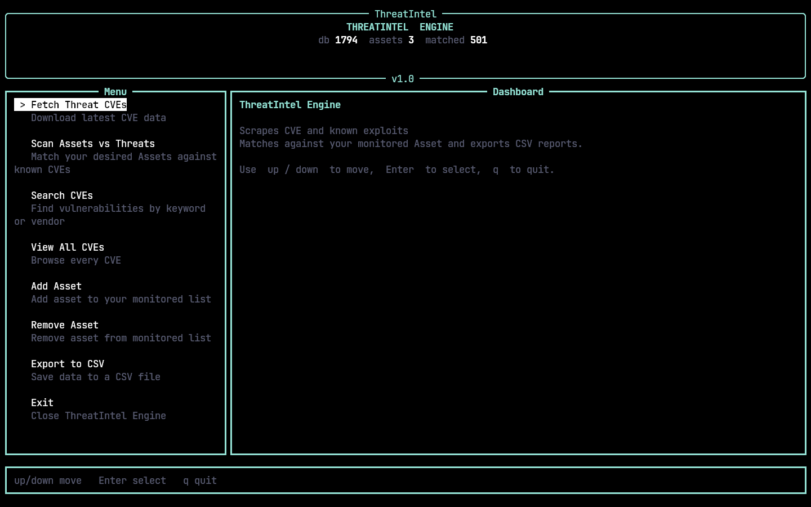
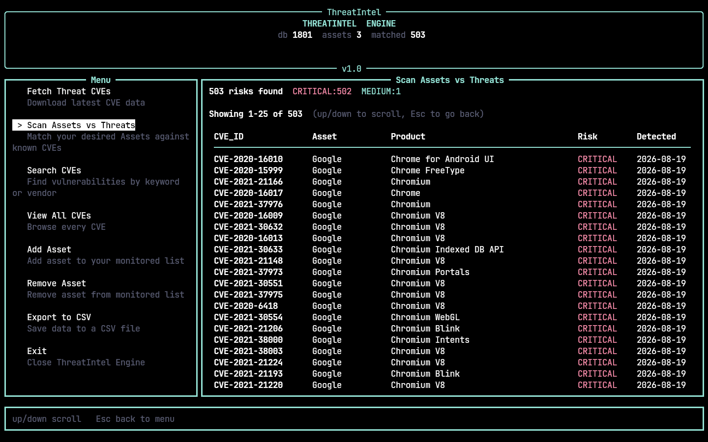
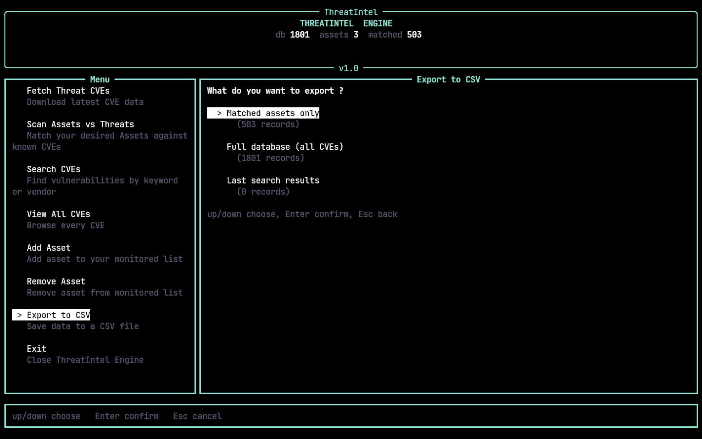

# TH-IGN

Simple Python script that scrapes CVE databases and compares to a local dabatase Assets and exports structured `.csv` reports.

## Screenshots

| Main Interface | Asset Overview | Report/Export Action |
| :---: | :---: | :---: |
|  |  |  |


## Step 1 - Installation & Setup

### Linux / macOS
```bash
git clone https://github.com/r1vita/TH-IGN.git
cd TH-IGN
python3 -m venv venv
source venv/bin/activate
python3 -m pip install -r requirements.txt
```

### Windows (! POWERSHELL !)
```powershell
git clone https://github.com/r1vita/TH-IGN.git
cd TH-IGN
python -m venv venv
Set-ExecutionPolicy -ExecutionPolicy Bypass -Scope CurrentUser
.\venv\Scripts\Activate.ps1
python3 -m pip install -r requirements.txt
```

## Step 2 - Run the .py file
```bash
python3 main.py
```
